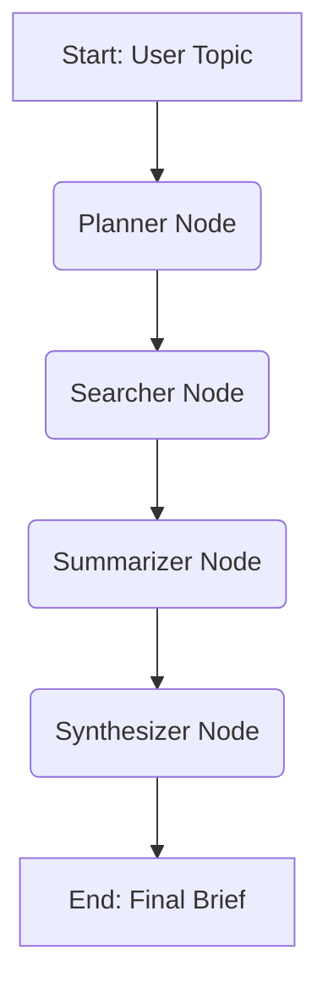

# Context-Aware AI Research Assistant 🧠✨


This project is a sophisticated, multi-step AI research assistant built using **LangGraph** and **LangChain**. It takes a user-provided topic and autonomously generates a comprehensive, structured, and evidence-backed research brief.

## Features

-   **Automated Research Planning**: The AI generates a structured plan, including key research questions and search queries, before acting.
-   **Live Web Search**: Utilizes the Tavily API to perform real-time web searches for the most current information.
-   **Per-Source Summarization**: Intelligently fetches and summarizes content from each source URL, extracting key points and relevance.
-   **Comprehensive Synthesis**: Combines all individual summaries into a final, coherent research brief using a powerful language model.
-   **Structured & Validated Outputs**: Employs Pydantic schemas to ensure all AI-generated content (plans, summaries, briefs) is structured, validated, and reliable.
-   **Dual LLM Strategy**: Uses a fast, efficient model (Llama 3 8B on Groq) for high-volume tasks like summarization and a powerful, high-reasoning model (Llama 3 70B on Groq) for planning and final synthesis.

## Tech Stack

-   **Orchestration**: `LangGraph`
-   **AI Abstractions**: `LangChain`
-   **LLMs**: `Groq` (Llama 3 8B & 70B)
-   **Search**: `Tavily AI`
-   **Schema & Validation**: `Pydantic`

---

## Architecture

The core of this application is a stateful graph that directs the flow of information through a series of nodes. Each node performs a specific task and updates a central "state" object.



1.  **Planner**: Receives the topic and generates a `ResearchPlan`.
2.  **Searcher**: Executes search queries from the plan using the Tavily client.
3.  **Summarizer**: Fetches content from each search result URL and creates a `SourceSummary`.
4.  **Synthesizer**: Combines all summaries into the `FinalBrief`.

---

## 🚀 Setup and Installation

Follow these steps to get the project running locally.

### 1. Clone the Repository

```bash
git clone <your-repository-url>
cd <your-repository-name>
```

### 2. Create and Activate a Virtual Environment

```bash
python -m venv venv
source venv/bin/activate
# On Windows, use: venv\Scripts\activate
```

### 3. Install Dependencies

```bash
pip install -r requirements.txt
```

### 4. Set Up Environment Variables

Create a `.env` file in the project root and add your API keys.

```env
# .env
GROQ_API_KEY="gsk_YourGroqApiKey"
TAVILY_API_KEY="tvly-YourTavilyApiKey"
```

---

## ▶️ Usage

To run the research assistant, execute the main application module from the project's root directory:

```bash
python -m app.main
```

The script will run with a default topic and print the final, formatted research brief to the console.

### Sample Output

```
================================================================================

## Research Brief: The Rise of AI in Modern Art

================================================================================

### Introduction

Artificial intelligence (AI) is rapidly emerging as a transformative medium and collaborator in the world of modern art...

### Synthesis

Analysis of various sources indicates that AI's role in art is multifaceted. AI art generators like Midjourney and DALL-E are enabling new forms of creative expression...

### Potential Follow-up Questions

1. How is the art market adapting to value and authenticate AI-generated artwork?
2. What are the long-term implications of AI on the definition of human creativity?

### References

1. [The Rise of AI Art - Artnews.com](https://www.artnews.com/...)
2. [How AI is Changing the Art World - Moma.org](https://www.moma.org/...)

================================================================================
```

---

## 📝 To-Do & Future Enhancements

-   [ ] **Implement Contextual Memory for Follow-ups**: Add a memory store (e.g., a dictionary or Redis) to save user briefs. Create a conditional entry point in the graph to summarize past interactions for follow-up questions, making the assistant context-aware.
-   [ ] **Expose via FastAPI & CLI**: Wrap the LangGraph application in a **FastAPI** server to expose a `POST /brief` endpoint. Additionally, create a formal **Command-Line Interface (CLI)** using `Typer` or `argparse` to accept the topic and other parameters.
-   [ ] **Integrate LangGraph Checkpointing**: Add a persistent checkpointer (e.g., `SqliteSaver`) to the graph. This makes the workflow resumable, which is critical for long-running research tasks that might be interrupted.
-   [ ] **Add Human-in-the-Loop Validation**: Introduce an interruption step after the `planner` node. The graph would pause and wait for user approval on the generated research plan via an API call before proceeding with the costly search and summarization steps.

## 📄 License

This project is licensed under the MIT License.
