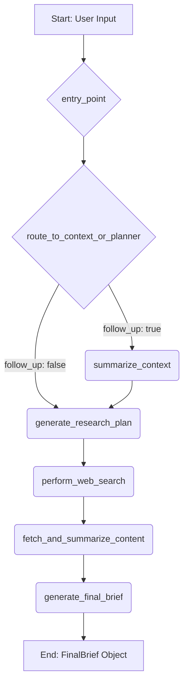

# AI Research Assistant

> A sophisticated, context-aware AI research assistant that generates structured, evidence-backed research briefs with conversational follow-up capabilities.

## 🚀 Features

- **Context-Aware Research**: Maintains persistent memory of past interactions for nuanced follow-up queries
- **Structured Output**: Generates comprehensive research briefs with citations and analysis
- **Multi-Model Strategy**: Optimized dual-LLM approach for cost and performance
- **Real-time Search**: Integration with Tavily AI for current, high-quality web search results
- **Stateful Workflows**: Built with LangGraph for complex, conditional routing
- **RESTful API**: FastAPI-based service with automatic data validation
- **Containerized Deployment**: Docker-ready for cloud deployment

## 🏗️ Architecture

The application uses a stateful graph workflow that dynamically handles new and follow-up queries:



### Workflow Components

1. **Entry Point & Routing**: Checks for follow-up queries and routes accordingly
2. **Context Summarization**: Retrieves and summarizes conversation history for follow-ups
3. **Research Planning**: Generates structured research questions and search queries
4. **Web Search**: Executes searches using Tavily API
5. **Content Summarization**: Processes and summarizes individual sources
6. **Final Synthesis**: Combines all sources into a coherent research brief

## 🛠️ Technology Stack

| Component | Technology | Rationale |
|-----------|------------|-----------|
| **Orchestration** | LangGraph | Stateful workflows with conditional routing |
| **AI Abstractions** | LangChain | Seamless LLM integration and structured outputs |
| **LLMs** | Groq (Llama 3 8B & 70B) | Dual-model strategy for cost/performance optimization |
| **Search** | Tavily AI | AI-optimized search API with clean, structured results |
| **Database** | SQLite | Lightweight, serverless persistence |
| **API Framework** | FastAPI | High performance with automatic validation |
| **Containerization** | Docker | Portable, reproducible deployments |

### Model Selection Strategy

- **Llama 3 8B (fast_llm)**: High-volume tasks (summarization, topic rewriting)
- **Llama 3 70B (smart_llm)**: Complex reasoning (planning, synthesis)

## 📋 Prerequisites

- Python 3.8+
- Docker Desktop
- Google Cloud CLI (for deployment)
- API Keys:
  - Groq API Key
  - Tavily API Key

## 🚀 Quick Start

### Local Development

1. **Clone the repository**
   ```bash
   git clone <repository-url>
   cd ai-research-assistant
   ```

2. **Set environment variables**
   ```bash
   export GROQ_API_KEY="your_groq_api_key"
   export TAVILY_API_KEY="your_tavily_api_key"
   ```

3. **Install dependencies**
   ```bash
   pip install -r requirements.txt
   ```

4. **Run the application**
   ```bash
   uvicorn app.main:app --reload
   ```

The API will be available at `http://localhost:8000`

### Docker Deployment

1. **Build the Docker image**
   ```bash
   docker build -t research-assistant-image .
   ```

2. **Run the container**
   ```bash
   docker run -p 8000:8000 \
     -e GROQ_API_KEY="your_key" \
     -e TAVILY_API_KEY="your_key" \
     research-assistant-image
   ```

## 📚 API Documentation

### Request Schema

```python
class ResearchRequest(BaseModel):
    user_id: str
    topic: str
    follow_up: bool = False
```

### Response Schema

```python
class FinalBrief(BaseModel):
    topic: str
    introduction: str
    synthesis: str
    references: List[SourceSummary]
    potential_follow_ups: List[str]
```

### Endpoints

#### POST /brief

Generate a research brief for a given topic.

**Example: Initial Request**
```bash
curl -X POST 'http://127.0.0.1:8000/brief' \
-H 'Content-Type: application/json' \
-d '{
    "user_id": "user_jodhpur_01",
    "topic": "What are the best places to visit in Jodhpur during the monsoon?",
    "follow_up": false
    "search_depth": "basic"
}'
```

**Example: Follow-up Request**
```bash
curl -X POST 'http://127.0.0.1:8000/brief' \
-H 'Content-Type: application/json' \
-d '{
    "user_id": "user_jodhpur_01",
    "topic": "Are any of those locations particularly good for photography?",
    "follow_up": true
    "search_depth": "basic"
}'
```

**Example Response**
```json
{
  "topic": "Best Photography Spots in Jodhpur during Monsoon",
  "introduction": "Jodhpur, the 'Blue City' of Rajasthan, offers a uniquely dramatic and photogenic landscape during the monsoon season...",
  "synthesis": "Based on the research, Mehrangarh Fort and Jaswant Thada are consistently cited as top locations...",
  "references": [
    {
      "url": "https://www.tourism.rajasthan.gov.in/jodhpur.html",
      "title": "Jodhpur Tourism - Official Rajasthan Site",
      "key_points": ["Mehrangarh Fort offers city views.", "Jaswant Thada is a marble marvel."],
      "relevance_to_topic": "Official source confirming key locations and their photographic appeal."
    }
  ],
  "potential_follow_ups": [
    "What is the best time of day for photography at Mehrangarh Fort during August?",
    "Are there any specific cultural events or festivals in Jodhpur during the monsoon?"
  ]
}
```

## 🌐 Cloud Deployment

### Google Cloud Run

1. **Build and push to Artifact Registry**
   ```bash
   gcloud builds submit --tag [REGION]-docker.pkg.dev/[PROJECT-ID]/[REPO]/research-assistant
   ```

2. **Deploy to Cloud Run**
   ```bash
   gcloud run deploy research-assistant \
     --image [IMAGE_URL_FROM_PREVIOUS_STEP] \
     --platform managed \
     --region [REGION] \
     --allow-unauthenticated \
     --set-env-vars="GROQ_API_KEY=your_key,TAVILY_API_KEY=your_key"
   ```

## 🔧 Configuration

### Environment Variables

| Variable | Description | Required |
|----------|-------------|----------|
| `GROQ_API_KEY` | Groq API key for LLM access | Yes |
| `TAVILY_API_KEY` | Tavily API key for web search | Yes |
| `DATABASE_PATH` | Path to SQLite database file | No (defaults to `./app/database.db`) |

## 📊 Data Schemas

### Core Schemas

- **ResearchRequest**: Incoming API request structure
- **ResearchPlan**: AI-generated research strategy
- **SourceSummary**: Individual source analysis
- **FinalBrief**: Complete research output

### Validation Strategy

- **API Boundary**: FastAPI automatic validation using Pydantic models
- **LLM Outputs**: Structured output enforcement with schema validation and retry logic

## ⚠️ Current Limitations

1. **Database Scalability**: SQLite is not suitable for multi-instance production environments
2. **Error Handling**: Basic error handling needs enhancement for production use
3. **Testing**: Lacks comprehensive unit and integration test suite
4. **CI/CD**: No automated testing and deployment pipeline
5. **Human Validation**: No human-in-the-loop validation for high-stakes research

## 🚧 Future Improvements

### Short Term
- [ ] Migrate to managed database service (Google Cloud SQL, Neon)
- [ ] Set up CI/CD pipeline

### Long Term
- [ ] Human-in-the-loop validation workflow
- [ ] Multi-language support
- [ ] Advanced caching mechanisms

## 📈 Performance Considerations

- **Cost Optimization**: Dual-model strategy reduces API costs by ~60%
- **Speed**: Fast LLM for repetitive tasks, smart LLM for complex reasoning
- **Memory**: Persistent context maintains conversation continuity
- **Scalability**: Stateless API design supports horizontal scaling

## 🤝 Contributing

1. Fork the repository
2. Create a feature branch (`git checkout -b feature/amazing-feature`)
3. Commit your changes (`git commit -m 'Add amazing feature'`)
4. Push to the branch (`git push origin feature/amazing-feature`)
5. Open a Pull Request

## 📄 License

This project is licensed under the MIT License - see the [LICENSE](LICENSE) file for details.


**Version**: 1.0.0  
**Last Updated**: August 23, 2025